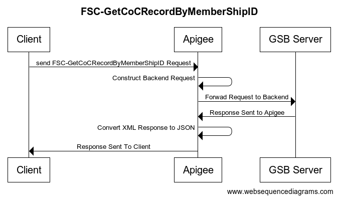

# FSC-GetCoCRecordByMemberShipID

## Table of Contents

- [FSC-GetCoCRecordByMemberShipID Documentation](#FSC-GetCoCRecordByMemberShipID)
    - [Introduction](#Introduction)
    - [Proxy Configuration](#Proxy-Configuration)
    - [Mediation](#Mediation)
    - [Error Codes and Messages Returned by Apigee](#Error-Codes-and-Messages-Returned-by-Apigee)

## Introduction
The objective of this document is to present API specification (between API clients and Apigee) including methods, URLs, request/response body formats, etc

## Security
So in order to make the proxy more secure we have created an OauthV2 Bearer token API and added Bearer Authentication to all proxies, you have to send the Token Api called **OAuth-Generate-Token** a request in order to get back a valid bearer token to use for the API’s Bearer Authentication.

## Proxy Configuration
#### Target Servers
[Target Servers Environment URL](https://edgeui-preprod.rega.gov.sa/platform/rega/environments/development/target-servers).

###### Target Server Configuration 
  
```xml
<TargetServer name="GSB">
 <IsEnabled>true</IsEnabled>
 <Host>192.168.12.34</Host>
 <Port>80</Port>
 <SSLInfo/>
</TargetServer>
```

#### proxy Information
##### Base Path
- [Dev Environment](https://api-dev.rega.gov.sa/v1/fsc/coc-records)

##### Proxy Name: FSC-GetCoCRecordByMemberShipID
| Functionality      | Verb |
| :---        |    :----:   |
| Get CoCRecord by membership id      | GET       | 

## Mediation

##### Flow


##### Query Parameters (Client Request to Proxy)

```
* Means Query parameter is required

Name: cocMemberChamberCity *
Type: integer

Name: cocMemberId
Type: string
```
##### Proxy Request to Backend
```xml
           <soapenv:Envelope xmlns:soapenv="http://schemas.xmlsoap.org/soap/envelope/" xmlns:tem="http://tempuri.org/">
                <soapenv:Header/>
                <soapenv:Body>
                    <tem:GetCoCRecordByMemberShipID>
                        <tem:cocMemberChamberCity>301</tem:cocMemberChamberCity>
                        <tem:cocMemberId>5</tem:cocMemberId>
                    </tem:GetCoCRecordByMemberShipID>
                </soapenv:Body>
            </soapenv:Envelope>
```

##### Backend Response To Proxy
```xml
<?xml version="1.0" encoding="UTF-8" ?>
<soapenv:Envelope
	xmlns:soapenv="http://schemas.xmlsoap.org/soap/envelope/"
	xmlns:tem="http://tempuri.org/">
	<soapenv:Header/>
	<soapenv:Body>
		<GetCoCRecordByMemberShipIDResponse>
			<tem:GetCoCRecordByMemberShipIDResult>
				<tem:CoCMembershipDetails>
					<tem:CoCMembershipID>5</tem:CoCMembershipID>
					<tem:CoCMembershipChamberCity>301</tem:CoCMembershipChamberCity>
					<tem:CoCMemberMembershipClass>0</tem:CoCMemberMembershipClass>
					<tem:CoCMemberSubscriptionToChamberDate>
						<tem:GregorianDate>2024-03-14</tem:GregorianDate>
						<tem:HijriDate>string</tem:HijriDate>
					</tem:CoCMemberSubscriptionToChamberDate>
					<tem:CoCMemberSubscriptionExpiryDate>
						<tem:GregorianDate>2024-03-14</tem:GregorianDate>
						<tem:HijriDate>string</tem:HijriDate>
					</tem:CoCMemberSubscriptionExpiryDate>
				</tem:CoCMembershipDetails>
				<tem:CoCMemberEst>
					<tem:CoCMemberEstNameAR>string</tem:CoCMemberEstNameAR>
					<tem:CoCMemberEstJuridicalFormAR>string</tem:CoCMemberEstJuridicalFormAR>
					<tem:CoCMemberEstNationalityAR>string</tem:CoCMemberEstNationalityAR>
					<tem:CoCMemberEstNumberOfBranches>0</tem:CoCMemberEstNumberOfBranches>
				</tem:CoCMemberEst>
				<tem:CoCMemberSijil>
					<tem:CoCMemberSijilNumber>string</tem:CoCMemberSijilNumber>
					<tem:CoCMemberSijilType>string</tem:CoCMemberSijilType>
					<tem:CoCMemberSijilSourceAR>string</tem:CoCMemberSijilSourceAR>
					<tem:CoCMemberSijilDate>
						<GregorianDate>2024-03-14</GregorianDate>
						<HijriDate>string</HijriDate>
					</tem:CoCMemberSijilDate>
					<tem:CoCMemberSijilExpiryDate>
						<GregorianDate>2024-03-14</GregorianDate>
						<HijriDate>string</HijriDate>
					</tem:CoCMemberSijilExpiryDate>
				</tem:CoCMemberSijil>
				<tem:CoCActivityType>
					<tem:CoCMemberMainActivityAR>string</tem:CoCMemberMainActivityAR>
					<tem:CoCMemberSecondaryActivityAR>string</tem:CoCMemberSecondaryActivityAR>
				</tem:CoCActivityType>
				<tem:CoCMemberOwner>
					<tem:CoCMemberOwnerNameAR>string</tem:CoCMemberOwnerNameAR>
					<tem:CoCMemberOwnerPrefixAR>string</tem:CoCMemberOwnerPrefixAR>
					<tem:CoCMemberOwnerGender>string</tem:CoCMemberOwnerGender>
					<tem:CoCMemberOwnerNationalityAR>string</tem:CoCMemberOwnerNationalityAR>
					<tem:CoCMemberOwnerPositionAR>string</tem:CoCMemberOwnerPositionAR>
				</tem:CoCMemberOwner>
				<tem:CoCMemberAddress>
					<tem:CoCMemberAddressPOBox>string</tem:CoCMemberAddressPOBox>
					<tem:CoCMemberAddressPostalCode>string</tem:CoCMemberAddressPostalCode>
					<tem:CoCMemberAddressStreetNameAR>string</tem:CoCMemberAddressStreetNameAR>
					<tem:CoCMemberAddressDistrictNameAR>string</tem:CoCMemberAddressDistrictNameAR>
					<tem:CoCMemberAddressDistrictNameEN>string</tem:CoCMemberAddressDistrictNameEN>
					<tem:CoCMemberAddressCityNameAR>string</tem:CoCMemberAddressCityNameAR>
					<tem:CoCMemberAddressRegionNameAR>string</tem:CoCMemberAddressRegionNameAR>
					<tem:CoCMemberAddressLocationInfo>string</tem:CoCMemberAddressLocationInfo>
					<tem:CoCMemberAddressWasselInfo>string</tem:CoCMemberAddressWasselInfo>
				</tem:CoCMemberAddress>
				<tem:CoCMemberPhone>
					<tem:CoCMemberPhoneNumber1>string</tem:CoCMemberPhoneNumber1>
					<tem:CoCMemberPhoneNumber2>string</tem:CoCMemberPhoneNumber2>
					<tem:CoCMemberPhoneNumber3>string</tem:CoCMemberPhoneNumber3>
					<tem:CoCMemberPhoneNumber4>string</tem:CoCMemberPhoneNumber4>
				</tem:CoCMemberPhone>
				<tem:CoCMemberFax>
					<tem:CoCMemberFaxNumber1>string</tem:CoCMemberFaxNumber1>
					<tem:CoCMemberFaxNumber2>string</tem:CoCMemberFaxNumber2>
					<tem:CoCMemberFaxNumber3>string</tem:CoCMemberFaxNumber3>
					<tem:CoCMemberFaxNumber4>string</tem:CoCMemberFaxNumber4>
				</tem:CoCMemberFax>
				<tem:CoCMemberMobile>
					<tem:CoCMemberMobileNumber1>string</tem:CoCMemberMobileNumber1>
					<tem:CoCMemberMobileNumber2>string</tem:CoCMemberMobileNumber2>
					<tem:CoCMemberMobileNumber3>string</tem:CoCMemberMobileNumber3>
					<tem:CoCMemberMobileNumber4>string</tem:CoCMemberMobileNumber4>
				</tem:CoCMemberMobile>
				<tem:CoCMemberEmail>
					<tem:CoCMemberEmail1>string</tem:CoCMemberEmail1>
					<tem:CoCMemberEmail2>string</tem:CoCMemberEmail2>
					<tem:CoCMemberEmail3>string</tem:CoCMemberEmail3>
					<tem:CoCMemberEmail4>string</tem:CoCMemberEmail4>
				</tem:CoCMemberEmail>
				<tem:CoCMemberWebSite>
					<tem:CoCMemberWebSite1>string</tem:CoCMemberWebSite1>
					<tem:CoCMemberWebSite2>string</tem:CoCMemberWebSite2>
					<tem:CoCMemberWebSite3>string</tem:CoCMemberWebSite3>
					<tem:CoCMemberWebSite4>string</tem:CoCMemberWebSite4>
				</tem:CoCMemberWebSite>
				<tem:CoCCapitalDetails>
					<tem:CoCMemberAnnouncedCapital>string</tem:CoCMemberAnnouncedCapital>
					<tem:CoCMemberPaidCapital>string</tem:CoCMemberPaidCapital>
					<tem:CoCMemberRateOfNationalCapital>string</tem:CoCMemberRateOfNationalCapital>
					<tem:CoCMemberRateOfForeignCapital>string</tem:CoCMemberRateOfForeignCapital>
					<tem:CoCMemberAllowedShares>string</tem:CoCMemberAllowedShares>
					<tem:CoCMemberPaidShares>string</tem:CoCMemberPaidShares>
					<tem:CoCMemberNumberOfSaudisMale>string</tem:CoCMemberNumberOfSaudisMale>
					<tem:CoCMemberNumberOfSaudisFemale>string</tem:CoCMemberNumberOfSaudisFemale>
					<tem:CoCMemberNumberOfNonSaudisMale>string</tem:CoCMemberNumberOfNonSaudisMale>
					<tem:CoCMemberNumberOfNonSaudisFemale>string</tem:CoCMemberNumberOfNonSaudisFemale>
				</tem:CoCCapitalDetails>
			</tem:GetCoCRecordByMemberShipIDResult>
		</tem:GetCoCRecordByMemberShipIDResponse>
	</soapenv:Body>
</soapenv:Envelope>

```
##### Proxy Response To Client
```json
{
  "GetCoCRecordByMemberShipIDResult": {
    "CoCMembershipDetails": {
      "CoCMembershipID": "string",
      "CoCMembershipChamberCity": 0,
      "CoCMemberMembershipClass": 0,
      "CoCMemberSubscriptionToChamberDate": {
        "GregorianDate": "2024-03-14",
        "HijriDate": "string"
      },
      "CoCMemberSubscriptionExpiryDate": {
        "GregorianDate": "2024-03-14",
        "HijriDate": "string"
      }
    },
    "CoCMemberEst": {
      "CoCMemberEstNameAR": "string",
      "CoCMemberEstJuridicalFormAR": "string",
      "CoCMemberEstNationalityAR": "string",
      "CoCMemberEstNumberOfBranches": 0
    },
    "CoCMemberSijil": {
      "CoCMemberSijilNumber": "string",
      "CoCMemberSijilType": "string",
      "CoCMemberSijilSourceAR": "string",
      "CoCMemberSijilDate": {
        "GregorianDate": "2024-03-14",
        "HijriDate": "string"
      },
      "CoCMemberSijilExpiryDate": {
        "GregorianDate": "2024-03-14",
        "HijriDate": "string"
      }
    },
    "CoCActivityType": {
      "CoCMemberMainActivityAR": "string",
      "CoCMemberSecondaryActivityAR": "string"
    },
    "CoCMemberOwner": {
      "CoCMemberOwnerNameAR": "string",
      "CoCMemberOwnerPrefixAR": "string",
      "CoCMemberOwnerGender": "string",
      "CoCMemberOwnerNationalityAR": "string",
      "CoCMemberOwnerPositionAR": "string"
    },
    "CoCMemberAddress": {
      "CoCMemberAddressPOBox": "string",
      "CoCMemberAddressPostalCode": "string",
      "CoCMemberAddressStreetNameAR": "string",
      "CoCMemberAddressDistrictNameAR": "string",
      "CoCMemberAddressDistrictNameEN": "string",
      "CoCMemberAddressCityNameAR": "string",
      "CoCMemberAddressRegionNameAR": "string",
      "CoCMemberAddressLocationInfo": "string",
      "CoCMemberAddressWasselInfo": "string"
    },
    "CoCMemberPhone": {
      "CoCMemberPhoneNumber1": "string",
      "CoCMemberPhoneNumber2": "string",
      "CoCMemberPhoneNumber3": "string",
      "CoCMemberPhoneNumber4": "string"
    },
    "CoCMemberFax": {
      "CoCMemberFaxNumber1": "string",
      "CoCMemberFaxNumber2": "string",
      "CoCMemberFaxNumber3": "string",
      "CoCMemberFaxNumber4": "string"
    },
    "CoCMemberMobile": {
      "CoCMemberMobileNumber1": "string",
      "CoCMemberMobileNumber2": "string",
      "CoCMemberMobileNumber3": "string",
      "CoCMemberMobileNumber4": "string"
    },
    "CoCMemberEmail": {
      "CoCMemberEmail1": "string",
      "CoCMemberEmail2": "string",
      "CoCMemberEmail3": "string",
      "CoCMemberEmail4": "string"
    },
    "CoCMemberWebSite": {
      "CoCMemberWebSite1": "string",
      "CoCMemberWebSite2": "string",
      "CoCMemberWebSite3": "string",
      "CoCMemberWebSite4": "string"
    },
    "CoCCapitalDetails": {
      "CoCMemberAnnouncedCapital": "string",
      "CoCMemberPaidCapital": "string",
      "CoCMemberRateOfNationalCapital": "string",
      "CoCMemberRateOfForeignCapital": "string",
      "CoCMemberAllowedShares": "string",
      "CoCMemberPaidShares": "string",
      "CoCMemberNumberOfSaudisMale": "string",
      "CoCMemberNumberOfSaudisFemale": "string",
      "CoCMemberNumberOfNonSaudisMale": "string",
      "CoCMemberNumberOfNonSaudisFemale": "string"
    }
  }
}

```
## Error Codes and Messages Returned by Apigee
| Title       | Error Type  | Response Code     |  Error Message  |
| :---        |    :----:   |     :----:    |      ---:    |
| FSC-GetCoCRecordByMemberShipID-401Unauthorized     | Unauthorized      | 401  |      ``` { "ServiceError":{"SourceAgency":"Apigee","ErrorType":"TechnicalError","Code":"401","ErrorText":"Unauthorized"}}```    |
| FSC-GetCoCRecordByMemberShipID-404NotFound      | Not Found       | 404  |      ``` { "ServiceError":{ "SourceAgency":"Apigee", "ErrorType":"TechnicalError", "Code":"404", "ErrorText":"Not Found" } } ```    |
| FSC-GetCoCRecordByMemberShipID-405MethodNotAllowed     | Method Not Allowed       | 405   |      ``` { "ServiceError":{ "SourceAgency":"Apigee", "ErrorType":"TechnicalError", "Code":"405", "ErrorText":"Method Not Allowed" } } ```    |
| FSC-GetCoCRecordByMemberShipID-415UnsupportedMediaType      | Unsupported Media Type       | 415  |      ``` { "ServiceError":{ "SourceAgency":"Apigee", "ErrorType":"TechnicalError", "Code":"415", "ErrorText":"Unsupported Media Type" } } ```    |
| FSC-GetCoCRecordByMemberShipID-RF-ExceptionDetailError      | Exception |   |    ```{ "RaisedBy": "string", "Code": "string", "ErrorText": "string", "Insert": [ "string" ] }```     |
| FSC-GetCoCRecordByMemberShipID-RF-FaultError      | Fault Error       |  | ```{ "RaisedBy": "string", "Code": "string", "ErrorText": "string", "Insert": [ "string" ] } ```   |
| FSC-GetCoCRecordByMemberShipID-RF-ServiceError400      | Bad Request       | 400  |      ```{TR-Res.ServiceError400}``` |
| FSC-GetCoCRecordByMemberShipID-RF-ServiceError      | Service Error       |   |     ``` { "RaisedBy": "string", "Code": "string", "ErrorText": "string", "Insert": [ "string" ] } ```   |
